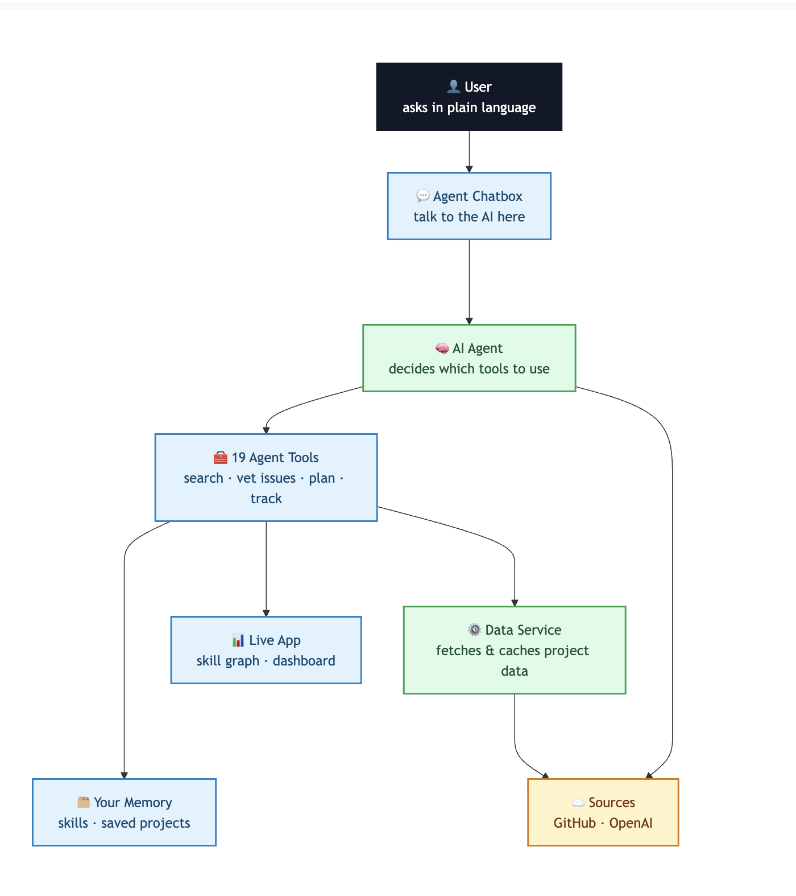

# OpenSource Discovery Hub

> **From "I want to contribute to open source" to a specific, unclaimed, doable issue — and a plan to fix it — in one conversation.**
>
> Built for the WebMCP Challenge: an app that gets better when a person *and* their agent use it together.

🔗 **Live app (hosted):** https://webmcp-integration.vercel.app/
_(The human UI works in any browser. To use the AI agent, open it in a WebMCP-enabled browser — see [Run it locally → step 3](#run-it-locally).)_

Finding your first (or next) open-source contribution is tedious: searching repos, vetting issues, checking if a project even reviews PRs. This app turns that into a conversation. You talk to an AI agent in plain language, and it does the digging — while you watch the results appear as an interactive skill graph and a contribution tracker.

It's built on **WebMCP**: the app exposes a set of tools that an AI agent can call directly in the browser. Humans and the agent work on the same screen, at the same time.

---

## Why WebMCP (and not just an API)

Without WebMCP, an agent has to *guess* its way through a website — scraping the DOM, clicking buttons, breaking whenever the UI changes. We flip that: the app **declares 19 structured tools** the agent calls directly, so it acts reliably instead of guessing. Two things fall out of that which a normal API can't do:

- **The agent can chain tools** to investigate for you — e.g. find issues, check which are actually free, then judge their real difficulty — all from one sentence.
- **The agent can drive the live UI** — highlighting a project makes the on-screen skill graph react in real time, so you and the agent are literally looking at the same page.

## Better together

The split is deliberate: the **agent** does the tedious, repetitive work no human wants to do by hand (scanning dozens of repos and issues, reading comment threads, sampling PR timings), and the **human** makes the judgment calls (which project feels right, which issue to commit to). Neither is as good alone — together, "I want to contribute" becomes a concrete, vetted plan in minutes.

## Architecture

<p align="center">
  
</p>

You ask in plain language through the **Agent Chatbox**. The **AI Agent** decides which of the **19 tools** to use and calls them; tools update the **live app** (skill graph, dashboard), read and write **your saved profile**, and reach out to **data sources** (GitHub, OpenAI) as needed. The AI key stays server-side, and tools run in your browser — so the agent can act reliably and even change what you see on screen.

---

## What you can do

**Ask the agent things like:**
- "Find me beginner Rust projects" → matches appear as a skill→project graph
- "In microsoft/vscode, which good-first-issues are actually free to work on?" → it checks each one for assignees, claim comments, and linked PRs
- "Is vercel/next.js responsive? Will my PR get reviewed?" → samples recent PRs for real response/merge times
- "Draft me a contribution plan for excalidraw" → setup steps, files to read, test commands, PR checklist
- "Track facebook/react" / "mark it as merged" → updates your dashboard live
- "Remember I know Rust and like developer tools" → the app remembers you; later just ask "what should I work on?"
- "Highlight the most-starred one" → that node glows in the graph

**Or do it yourself** — the search page, filters, project cards, stats charts, and dashboard all work without the agent. Whatever the agent does shows up in the same UI you can drive by hand.

---

## The tools (19)

**Discovery**
- `search_projects` — search by tech, domain, stars, activity
- `match_skills_to_projects` — personalized matches; populates the skill graph
- `get_mentorship_projects` — GSoC, Outreachy, MLH, Hacktoberfest
- `summarize_project` — purpose, tech stack, community health
- `estimate_first_response_time` — how fast a project reviews PRs

**Issue vetting**
- `find_issues` — open issues, filtered by label / difficulty / skill
- `check_issue_availability` — is it free, claimed, or taken? (with evidence)
- `assess_issue_difficulty` — real difficulty beyond the label
- `explain_issue` — a beginner-friendly breakdown
- `check_contribution_requirements` — CLA, tests, code style, PR process

**Guidance & tracking**
- `draft_contribution_plan` — AI-written step-by-step first-contribution plan
- `track_contribution` — save / update status on your dashboard
- `summarize_my_progress` — your stats: top languages, fastest merge, completion rate

**Remember me (personalization)**
- `set_skill_profile` — add/remove skills & interests, or clear them
- `get_skill_profile` — "what do you remember about me?"
- `get_recommendations` — suggestions from your saved profile

**Drive the graph (agent changes what you see)**
- `highlight_project` — glow a node (by name or "most-starred/forked")
- `focus_skill` — isolate one skill's cluster
- `reset_graph` — restore the full view

---

## Run it locally

**1. Environment** — create `.env.local`:
```
GITHUB_TOKEN=your_github_pat        # read-only public access is enough
OPENAI_API_KEY=your_openai_key
OPENAI_MODEL=gpt-4o-mini
NEXT_PUBLIC_APP_URL=http://localhost:3000
```

**2. Install and start:**
```
npm install
npm run dev        # http://localhost:3000
```
Next.js reads env vars at startup — restart if you change a key.

**3. Use the agent (needs WebMCP):** WebMCP is still experimental, so it's behind a browser flag.
- **Chrome / Edge (150+):** open `chrome://flags` (or `edge://flags`), search `webmcp`, enable **"WebMCP for testing"**, then restart the browser.
- **ChatGPT's in-app browser:** also supports WebMCP.

Then open the app and click **"Ask the Agent"** (bottom-right). To confirm the tools registered, open the browser console and run `await document.modelContext.getTools()` — you should get all 19.

Without WebMCP the site still works — you just drive the UI yourself instead of via the agent (graceful degradation).

---

## How it works

The browser holds the WebMCP tools (`document.modelContext`); the OpenAI key stays server-side in `app/api/agent/route.ts`. When you type into the **"Ask the Agent"** chatbox, `AgentChat` reads the available tools, asks the model what to do, runs the chosen tools in the browser, feeds the results back, and repeats — so a single request can chain several tools automatically (e.g. `find_issues` → `check_issue_availability` → `assess_issue_difficulty`).

Most tools fetch data from GitHub; a few run entirely in the browser to drive the UI (the skill graph) or your saved profile. One tool, `draft_contribution_plan`, "thinks" — its route makes its own model call to synthesize a plan from the repo's README and CONTRIBUTING guide, and it stays honest, saying "not documented — check the repo" instead of inventing commands.

The same backend routes (`app/api/tools/*`) serve both the agent and the human UI, so there's one source of truth. Tracked projects and your skill profile live in the browser's localStorage — no login, no database.

```
components/webmcp/ToolRegistry.tsx   register the 19 WebMCP tools
app/api/agent/route.ts               OpenAI function-calling (server-side)
components/AgentChat.tsx             the chat + browser tool loop
app/api/tools/*/route.ts             tool backends (live GitHub data via Octokit)
lib/tracker.ts, lib/profile.ts       localStorage stores (dashboard + memory)
components/viz/*                      skill graph (D3), stats (Recharts), journey (React Flow)
```

---

## Tech stack

Next.js 14 · TypeScript · Tailwind · Octokit (GitHub API) · OpenAI · D3, Recharts, React Flow, Framer Motion for the visualizations.

For a full demo walkthrough, see [DEMO.md](DEMO.md).

## License

MIT — see [LICENSE](LICENSE).
